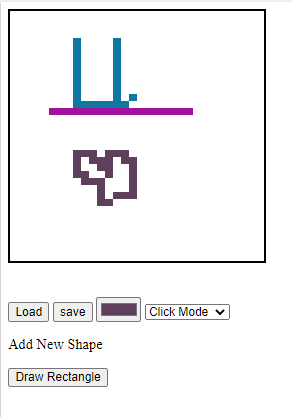

# Pixel-Art-JS

build a JavaScript Pixel art Applaction 
I love JavaScript  (version 1.1 6 js lines only)

## version 1.1


## last update:
1.  I added new Draw Function to draw static shapes.
2.  I added a new awesome function Save (Save your paint while session open).
3.  I added a second awesome function load (load your saved paint ) OMG.
4.  Note There is no database so this gonna save your code and load it while you didn't reload browser.
5.  Please Note While no database it's better to use save and load only once (Sometimes it work normal for 
more than 2 saves But to keep it easy use it one time only per session.

## How To Use it:

1.  it will be on default mode which is click you can use mouse clicks to draw.
2.  You Can click on right click to switch bettween modes (mousemove or click) << this make it awesome.
3.  I can also use this insted of switch mode make it an eraser But siwtch would be more helpfull.
4.  It will start with default color "black" select the color you need and start drawing.
5.  screet tip try to use click mode then stand on the point you need then switch if you need pause move right click.


## what is the main idea:

But I used this with querySelectorAll td and in for loop to add the event to all td elements 
then get the target or which elements user clicked the change background style I also push this
target to list (saver) this is save each element the user clicked when user click on save
I make a copy from this array or saver list in another list , if used click on load I change the 
style for the selected elements and make other td background white (it will act like save and load)

``` javascript
document.addEventListener('click', () => {
  var x =  event.target;
  x.style.background = "blue";
});


```
## version 3.1



## Wanna Try Last Version 3.1 on the fly:
  https://partibleburn.htmlpasta.com/
  


## old Version 2.1:
  https://filtrablevulture.htmlpasta.com/

## or check it on my own server at: http://18.196.30.95/paint

